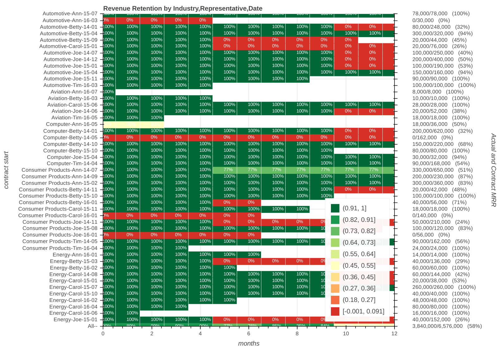

#My one week stint working for a startup.#
##(I learned Bokeh)##

I can't believe it, but my consulting project with a Bay Area startup only lasted 6 days.  My job was to use customer data to visualize customer retention by various sectors, sales people, and vintage of customer.
  
  At least I learned how to use Bokeh, which is a Python library that renders interactive Javascript Charts.  See the one below.  My script generates random customer data and creates a pretty cool interactive heat map for retention values.
  

